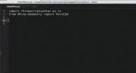

# rhino-python

Code completion support for your Python scripts that are executed by [Rhinoceros for Mac] (https://www.rhino3d.com/mac).

  

## Installation

  - Download and install the latest [Rhino 5 for Mac][2]
  - Download and install the [Atom text editor][1] (tested with version 0.184.0)
  - From the "Atom" menu select "Install Shell Commands" in case they are not already installed.
  - Close Atom
  - Open a terminal window (In Finder: Applications/Utilities/Terminal.app)
  - In the terminal window type the following 2 commands:  
    **```apm install autocomplete-plus@2.3.0```**  
    **```apm install rhino-python```**

## Quick Start

  - From Rhino run the **```StartAtomEditorListener```** command.
  - Launch the Atom editor and save the "untitled" document as mypythonscript.py.  The file needs to have a ".py" extension for the rhino-python package to be activated.
  - Type **```import ```** (trailing space) and a window with completion data will pop up.
  - As you type **```rhinos```** you'll see the completion data list get filtered until the only option left is "rhinoscriptsyntax".  Press the <kbd>tab</kbd> key to accept it.  The finished line is:  
  **```import rhinoscriptsyntax as rs```**
  - On the next line type **```from Rhino.Geometry import Point3d```**.  The completion data will pop up for **```Rhino```**, **```Geometry```**, and **```Point3d```**.  Press the <kbd>tab</kbd> key to accept each.
  - For the next line type **```rs.AddCircle(Point3d.Origin, 5.0)```** and again notice the completion window after each <kbd>.</kbd> and the doc string panel after the <kbd>(</kbd>. Keep typing until the desired data is highlighted in the completion window and press the <kbd>tab</kbd> key to accept.
  - To send the file to Rhino for execution press the <kbd>ctrl</kbd>-<kbd>alt</kbd>-<kbd>r</kbd> keys.

## A useful workflow

ln -s ~/Library/Application\ Support/McNeel/Rhinoceros/MacPlugIns/ironpython/settings/samples samples

The Atom text editor and the rhino-python package are both early releases.  Atom (now at 0.174.0) is evolving rapidly and may introduce breaking changes as it moves towards a 1.0 release so the rhino-python package will need to be updated to keep up with the changes.  We chose Atom because it's a new editor that holds a lot of promise: it is made by the folks at GitHub, is getting a lot of attention,  is cross platform, and is open source.  Let us know what you think ...


  [1]: https://atom.io
  [2]: http://https://www.rhino3d.com/download/rhino-for-mac/5.0/wip
